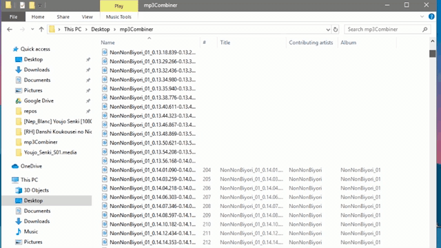

Very small script to combine audio files produced from the program subs2srs (http://subs2srs.sourceforge.net/) into larger sections.

Usage: In a folder that contains this script and mp3cat (https://darrenmulholland.com/dev/mp3cat.html), copy any subs2srs audio files that you want to combine. Run the script.

The script will sort the files by episode, so you can combine multiple episodes, seasons, movies, or any other combination at the same time.

BONUS: If you run the script a second time on the same files, it'll combine all the episodes together into their respective seasons.

